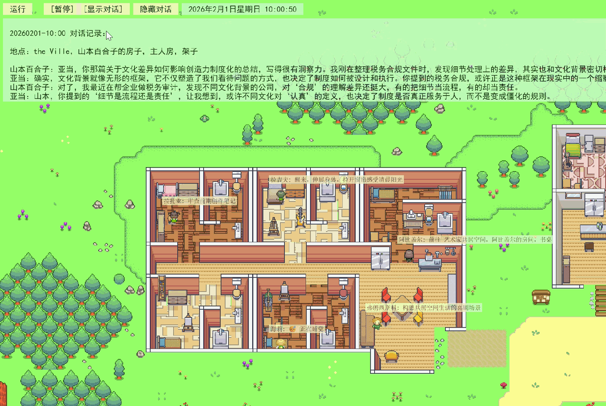
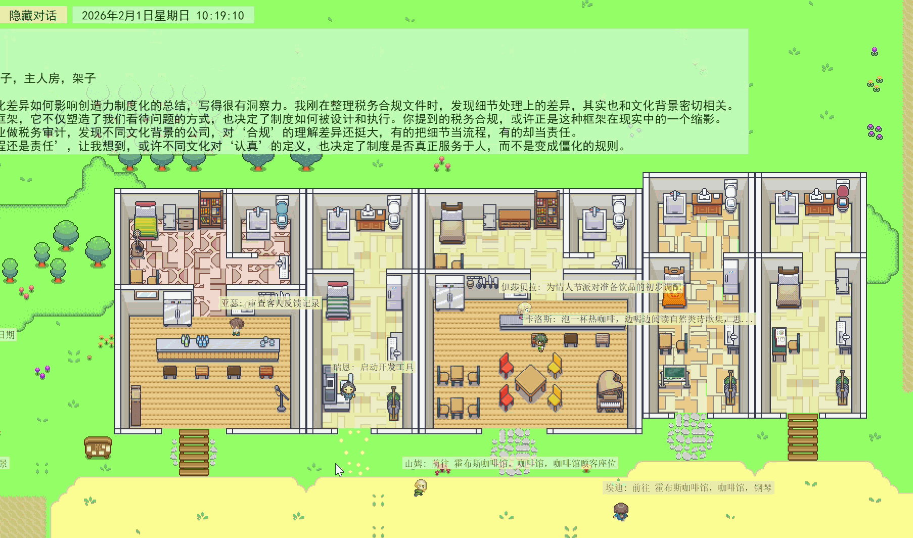
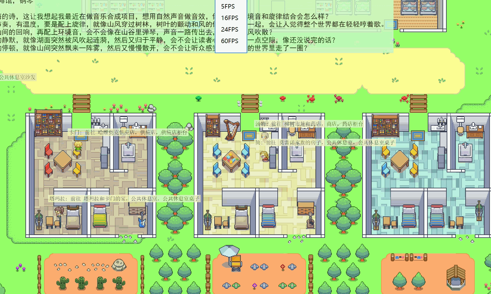

# Generative Agents RL: Self-Evolving Multi-Agent Simulation

<div align="center">


-orange>)


**[简体中文]** | [English](./README_en.md)

_基于斯坦福Generative Agents论文项目的深度汉化与**认知强化学习 (Cognitive Reinforcement Learning)** 增强版_

</div>

---

## 概述

本项目旨在探索 **LLM 驱动的智能体社会** 向 **具备自我进化能力的多智能体系统 (MAS)** 的演进。

在原版 [Generative Agents](https://arxiv.org/abs/2304.03442) 的基础上，我们引入了 **Agentic RL** 闭环。通过构建 **GRPO (Group Relative Policy Optimization)** 策略网络，并创新性地将其与 **In-Context Learning (上下文学习)** 相结合，实现了数值奖励信号向符号化认知提示的转化。这使得智能体不仅能“模拟”人类行为，更能通过环境反馈“学习”并优化协作策略。

### 全景展示


## 主要工作

### 1. 去中心化 GRPO 策略优化

> _摒弃 Value Network，直接优化策略分布，实现极低开销的在线学习。_

- **组内相对优势估计 (Group-Relative Advantage)**：采用 GRPO 算法核心思想，通过计算 Agent 在动态组内的相对表现（而非绝对奖励）来归一化优势函数，有效解决了多智能体环境下的 **非平稳性 (Non-stationarity)** 问题。
- **离散化动作空间映射**：将连续的语义意图映射为 `Move`, `Chat`, `Task`, `Research` 等离散动作原语，构建了可微分的策略更新路径。

### 2. 神经-符号反馈

> _打通数值奖励与自然语言推理之间的鸿沟。_

- **奖励信号语义化 (Reward-to-Prompt Injection)**：不同于传统 RL 仅更新权重，我们将高价值轨迹（High-Reward Trajectories）转化为自然语言描述，动态注入到 LLM 的 System Prompt 中。
- **认知强化 (Cognitive Reinforcement)**：智能体能够“感知”到哪些行为模式带来了正向反馈（如高效协作、精准信息共享），从而在后续的 **Chain-of-Thought (CoT)** 推理中自发偏向高回报行为。

### 3. 动态联盟与任务编排

> _支持 Ad-hoc Teamwork 的弹性组织架构。_

- **属性驱动聚类**：基于 Agent 的语义属性（如 `group: artist_group`）自动构建 RL 计算图，无需人工硬编码拓扑结构。
- **异构策略并行**：支持多个异构小组（如“科学家组”追求知识产出，“竞选组”追求影响力）在同一沙箱中并行训练，互不干扰，模拟复杂的社会分工。

### 4. 任务驱动的记忆共鸣

> _基于当前目标的动态记忆重排序。_

- **多维检索评分**：在传统的 `Recency`, `Importance`, `Relevance` 之外，引入第四维度 **Task Resonance**。
- **注意力聚焦**：确保 Agent 在决策时能优先召回与当前主线任务高度相关的记忆片段，防止长程任务中的目标漂移。

### 5. LLM-as-a-Judge 评估框架

> _基于大模型的语义级多维量化评估。_

- **语义一致性校验**：利用 DeepSeek-R1 / Qwen2.5 等推理模型，对仿真日志进行深度语义分析。
- **多维度量化指标**：
  - **Task Alignment**: 行为序列与长期目标的对齐度。
  - **Interaction Efficiency**: 信息熵视角下的交互有效性。
  - **Persona Consistency**: 长期记忆与即时行为的人设一致性。

---

## 🛠️ 快速运行

### 1. 环境构建

```bash
# 克隆仓库
git clone https://github.com/xi029/GenerativeAgentsRL
cd GenerativeAgentsRL

# 构建轻量级虚拟环境
conda create -n agent python=3.12
conda activate agent

# 安装依赖
pip install -r requirements.txt

#配置大模型
修改配置文件 `generative_agents/data/config.json`:
1. 默认使用[Ollama](https://ollama.com/)加载本地量化模型，并提供OpenAI兼容API。需要先拉取量化模型（参考[ollama.md](docs/ollama.md)），并确保`base_url`和`model`与Ollama中的配置一致。
2. 如果希望调用其他OpenAI兼容API，需要将`provider`改为`openai`，并根据API文档修改`model`、`api_key`和`base_url`。
```

### 2. 定义智能体画像 (可选)

通过 JSON 配置动态注入 RL 属性，无需修改代码：

_文件: `generative_agents/frontend/static/assets/village/agents/阿比盖尔/agent.json`_

```json
{
  "name": "阿比盖尔",
  "innate": "数字艺术家...",
  "group": "artist_collective",  // [RL] 定义所属策略组
  "task": "最大化艺术展的社区影响力", // [RL] 定义优化目标
  ...
}
```

### 3. 启动进化仿真

```bash
cd generative_agents
# 启动仿真，步长设为10以观察策略收敛
python start.py --name sim-test --step 10 --stride 10
```

参数说明:

- `name` - 每次启动虚拟小镇，需要设定唯一的名称，用于事后回放。
- `start` - 虚拟小镇的起始时间。
- `resume` - 在运行结束或意外中断后，从上次的“断点”处，继续运行虚拟小镇。
- `step` - 在迭代多少步之后停止运行。
- `stride` - 每一步迭代在虚拟小镇中对应的时间（分钟）。假如设定`--stride 10`，虚拟小镇在迭代过程中的时间变化将会是 9:00，9:10，9:20 ...

### 4. 生成回放数据

```
python compress.py --name sim-test
```

运行结束后将在`results/compressed/sim-test`目录下生成回放数据文件`movement.json`。同时还将生成`simulation.md`，以时间线方式呈现每个智能体的状态及对话内容。

### 5. 启动回放服务

```
python replay.py
```

通过浏览器打开回放页面（地址：`http://127.0.0.1:5000/?name=sim-test` ），可以看到虚拟小镇中的居民在各个时间段的活动。

注意：只能通过键盘方向键移动画面

参数说明

- `name` - 启动虚拟小镇时设定的名称。
- `step` - 回放的起始步数，0代表从第一帧开始回放，预设值为0。
- `speed` - 回放速度（0-5），0最慢，5最快，预设值为2。
- `zoom` - 画面缩放比例，预设值为0.8。

若希望以较快速度从头开始回放，画面缩放比例为0.6，则对应的url是：
http://127.0.0.1:5000/?name=sim-test&step=0&speed=2&zoom=0.6

也可直接打开[simulation.md](generative_agents/results/compressed/example/simulation.md)，查看`example`中所有人物活动和对话信息。

### 4. 效果验证

使用内置的 `eval.py` 进行 A/B 测试：

```bash
# 对比 Baseline 与 RL 版本的表现
python eval.py \
  --before results/compressed/baseline/simulation.md \
  --after results/compressed/evolution_v1/simulation.md \
  --model deepseek-chat
```

### 6. 回放截图

_画面中对话内容由qwen3:4b-instruct-q4_K_M生成_

居民楼



咖啡馆



宿舍


## 🤝 引用与致谢

本项目基于以下工作构建：

- **Generative Agents**: [Park et al., 2023](https://arxiv.org/abs/2304.03442)
- **DeepSeek-R1**: [DeepSeek AI, 2024](https://api.deepseek.com)
- **Codebase Refactoring**: [wounderland](https://github.com/Archermmt/wounderland)
- **GenerativeAgentsCN**: [GenerativeAgentsCN](https://github.com/x-glacier/GenerativeAgentsCN)

特别感谢@x-glacier对Generative Agents项目中文重构工作的贡献。

## 📄 License

Apache-2.0 license
